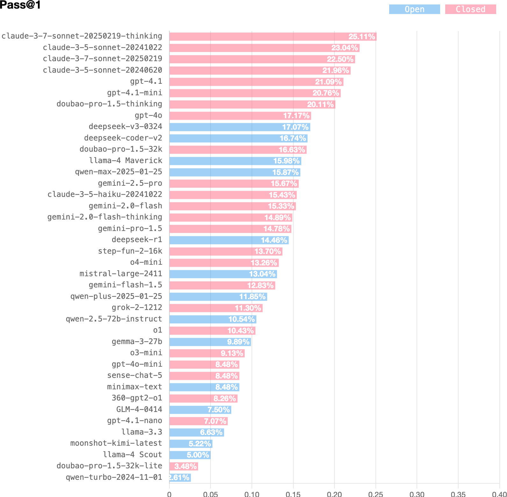
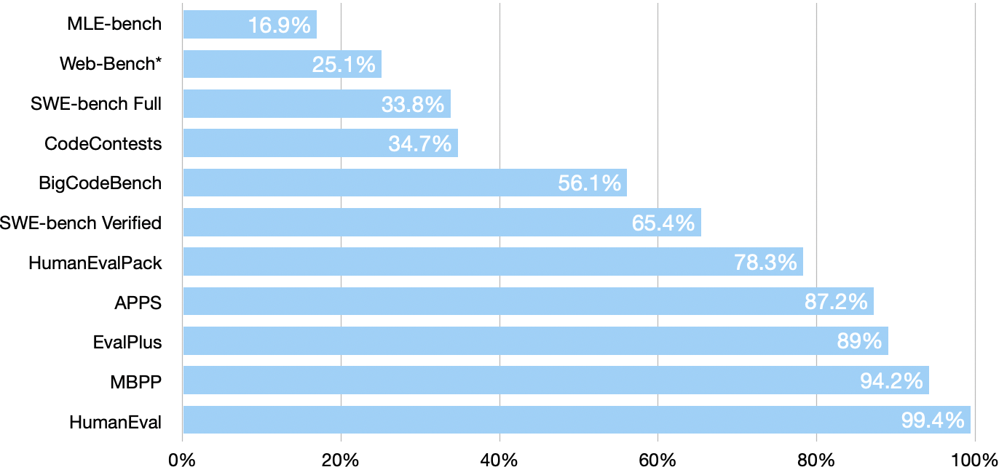

# Web-Bench

<p align="center">
    <a href="./README.md">English</a> •
    <a href="https://arxiv.org/abs/2505.07473">论文</a> •
    <a href="https://huggingface.co/datasets/bytedance-research/Web-Bench">数据集</a> •
    <a href="https://huggingface.co/spaces/bytedance-research/Web-Bench-Leaderboard">排行榜</a> •
    <a href="#-citation">引文</a>
</p>

## **📖** 概要

**Web-Bench** 是一个用于评估 LLM 在真实 Web 项目上表现的基准。Web-Bench 包含 50 个项目，每个项目包含 20 个有时序依赖关系的任务，逼真模拟了人类开发项目的过程。Web-Bench 在设计时考虑了如何覆盖 Web 应用开发所依赖的基础：Web Standards 和 Web Frameworks。由于它们的庞大规模和复杂度，以及设计项目的工程师具备 5-10 年开发经验，最终设计出来的项目对于人类资深工程师而言都具有一定的复杂度（单项目平均 4-8 小时完成）。并且我们给定的基准 Agent 上，SOTA（Claude 3.7 Sonnet）Pass@1 仅有 25.1%。

实验数据的分布和当前主流 LLM 代码生成能力也较匹配。


HumanEval 和 MBPP 已趋于饱和，APPS 和 EvalPlus 也正在接近饱和状态。Web-Bench 的 SOTA 为 25.1%，低于 (低更好) SWE-bench Full 和 Verified。


## 🚀 安装

Web-Bench 使用 Docker 进行评测. 可以根据 https://docs.docker.com/engine/install/ 安装 Docker 环境，并根据以下步骤：

### 初始化

```Bash
git clone https://github.com/bytedance/Web-Bench.git

cd Web-Bench
```

### 配置

确认根据使用的 agent 配置确认使用方式：

- **使用 HTTP-Agent**

  - 本地创建文件`apps/eval/src/config.json5`

    ```json
    {
      "agentMode": "http",
      "agentEndPoint": "http://example.com/path/to/agent"
    }
    ```

- **使用 Local-Agent**

  - 本地创建文件 `apps/eval/src/config.json5 `

    ```json
    {
      "models": ["claude-3-5-sonnet-20241022", "openai/gpt-4o"],
      "agentMode": "local"
    }
    ```

  - 本地创建文件`apps/eval/.env`

    ```
    ANTHROPIC_API_KEY=xxx
    OPENROUTER_API_KEY=xxx
    # Comment
    # OPENAI_API_KEY=xxx
    ```

    XXX_API_KEY is used in `apps/eval/src/model.json`

    ```JSON
    {
      "models": [
        {
          "model": "claude-3-5-sonnet-20241022",
          "apiKey": "{{ANTHROPIC_API_KEY}}"
        },
        {
          "model": "openai/gpt-4o",
          "apiKey": "{{OPENROUTER_API_KEY}}"
        }
      ]
    }
    ```

**配置参数**

| parameter     | type                                   | default | description                                                  |
| :------------ | :------------------------------------- | :------ | :----------------------------------------------------------- |
| projects      | string[]                               | []      | 如果为空，则传入所有 projects。值示例： "@web-bench/calculator". |
| agentMode     | "local" \| "http"                      | "local" |                                                              |
| agentEndPoint | string                                 | ""      | 当 agent 模式为 http 时，请求的 api                          |
| models        | string[]                               | []      | `apps/eval/src/model.json` 中配置的模型                      |
| maxdop        | number                                 | 30      | 最大并行任务数                                               |
| logLevel      | "info" \| "warn" \| "debug" \| "error" | "info"  |                                                              |
| httpLimit     | number                                 | 10      | 当 agent 模式为 http 时，http 最大并发数                     |

### 构建

```Bash
docker build -f ./start.dockerfile -t web-bench .
```

## 📘 使用

```JSON
docker run web-bench
```

评测结果输出在 Docker Container：`app/apps/eval/report`

## **📌** 常见问题

### Web-Agent 和 HTTP-Agent 的区别

- Web-Agent: Web-Agent 有基础和 LLMs 的交互能力。可以直接传入 `apps/eval/src/model.json` 中配置的模型。
- HTTP-Agent: 通过 HTTP-Agent，调用 `agentEndPoint` 配置的接口请求自定义 Agent。

### 新增模型进行评测

1. 对于已经部署在 Openrouter 的模型，可以参考一下配置使用 Openrouter provider：

```json
{
  "title": "anthropic/claude-3-opus",
  "provider": "openrouter",
  "model": "anthropic/claude-3-opus",
  "apiBase": "https://openrouter.ai/api/v1",
  "apiKey": "{{OPENROUTER_API_KEY}}"
}
```

2. 当前已有 provider 不能满足诉求可以通过新增 provider 来进行评测具体模型，通过继承 `BaseLLM` 来实现：

   ```typescript
   export abstract class BaseLLM {
     abstract provider: string
     abstract option: LLMOption
     info: Model
     abstract chat(
     	compiledMessages: ChatMessage[],
       originOptions: CompletionOptions
   	): Promise<{
   		request: string
       error?: string
       response: string
     }>
   }
   ```

   1. `option` – 设置请求 LLM 具体参数:

      ```typescript
      export interface LLMOption {
        contextLength: number
        maxTokens: number
        temperature?: number
        apiBase: string
      }
      ```

   2. `info` – `apps/eval/src/model.json` 中配置的基础信息

   3. `chat` – 自定义请求方法，返回 LLM 生成的文本

### 新增自定义 Agent 进行评测

Web-Bench 支持自定义 Agent 能力通过使用HTTP-Agent

在 "Call Agent" 阶段，HTTP-Agent 会将:

1. Evaluator 上下文传递给 CustomAgent；

2. 将 CustomAgent 不做处理直接返回

所以，CustomAgent 请求和返回需要参考以下格式：

```go
export interface AgentRequest {
  type: 'normal' | 'init'

  task: string

  // Code files, key is filePath, value is fileContent
  files?: Record<string, string>

  // Error context
  error?: string
}


export interface AgentResponse {
  // Code files, key is filePath, value is fileContent
  files: Record<string, string>

  // [filePath:string]: string  Poor Extension
}
```

## **🛠️** 贡献

* [项目贡献指南](https://github.com/bytedance/web-bench/wiki/Project-Contribution)


## **📚** 引文

```bibtex
@misc{xu2025webbench,
      title={Web-Bench: A LLM Code Benchmark Based on Web Standards and Frameworks}, 
      author={Kai Xu and YiWei Mao and XinYi Guan and ZiLong Feng},
      year={2025},
      eprint={2505.07473},
      archivePrefix={arXiv},
      primaryClass={cs.AI},
      url={https://arxiv.org/abs/2505.07473}, 
}
```


## **📄** 许可证

[Apache 2.0](./LICENSE.md)
