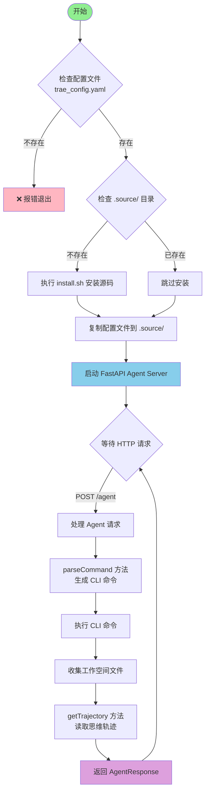

# Agent Server 文档

## 1. Agent Server 是什么？


Agent Server 是一个基于 FastAPI 的 HTTP 服务，它提供了一个统一的接口 `/agent` 来执行 AI Agent 任务。这个服务支持：

- 接收包含代码文件和任务描述的请求
- 在隔离的工作空间中执行任务
- 返回执行结果、文件变更和思维轨迹
- 可通过扩展快速支持新的 Agent 类型

### 接口定义

#### POST /agent

**请求格式：**

```json
{
  "type": "normal",
  "files": {
    "src/main.py": "print('Hello World')",
    "README.md": "# My Project\n\nThis is a sample project."
  },
  "task": "请帮我优化这段代码，添加错误处理并改进代码结构",
  "error": null
}
```

**响应格式：**

```json
{
  "taskId": "20241201-143052-a1b2c3",
  "files": {
    "src/main.py": "def main():\n    try:\n        print('Hello World')\n    except Exception as e:\n        print(f'Error: {e}')\n\nif __name__ == '__main__':\n    main()",
    "README.md": "# My Project\n\nThis is an improved version with better error handling."
  },
  "trajectory": "[Agent思考过程...]",
  "stdout": "代码执行成功\n",
  "stderr": "",
  "exit_code": 0,
  "error": null,
  "start_time": "2024-12-01T14:30:52.123456",
  "end_time": "2024-12-01T14:31:15.654321"
}
```

**字段说明：**

- `type`: 请求类型，通常为 "normal"
- `files`: 文件映射，键为文件路径，值为文件内容
- `task`: 任务描述，告诉 Agent 需要做什么
- `error`: 可选的错误上下文信息

## 2. 如何运行 Agent Server

```
uv sync
<!-- 运行你选择的 Agent Server -->
uv run python -m qwen-code.main
```

## 3. Eval 如何接入 Agent Server

要在 evaluation 系统中使用 Agent Server，需要在 `config.json5` 中进行如下配置：

```json
{
  "project": ["@web-bench/react"],
  "agentMode": "http",
  "agentEndPoint": "http://localhost:8000/agent"
}
```

配置说明：

- `agentMode`: 必须设置为 "http" 以使用 HTTP 模式的 Agent
- `agentEndPoint`: Agent Server 的地址，默认为 `http://localhost:8000/agent`

## 4. 如何新增 Agent Server（以 Trae Agent 为例）

### 步骤 1：编写 Agent-Server 运行逻辑

创建一个新的目录，例如 `trae-agent/`，然后创建 `main.py`：

**代码文件：** `/agents/trae-agent/main.py`

运行逻辑如下图所示：



### 步骤 2：运行 Agent Server

```
uv sync
uv run python -m trae.main
```

服务将在 `http://localhost:8000` 启动，可以通过 `/agent` 接口接收请求。

## 其他 Agent 示例

### Qwen Code Agent

位于 `qwen-code/` 目录，使用 Qwen 模型执行代码生成任务。
