# Agent Server Documentation

## 1. What is Agent Server?


Agent Server is a FastAPI-based HTTP service that provides a unified `/agent` endpoint for executing AI Agent tasks. This service supports:

- Receiving requests containing code files and task descriptions
- Executing tasks in isolated workspaces
- Returning execution results, file changes, and thought trajectories
- Rapidly supporting new Agent types through extensions

### API Definition

#### POST /agent

**Request Format:**

```json
{
  "type": "normal",
  "files": {
    "src/main.py": "print('Hello World')",
    "README.md": "# My Project\n\nThis is a sample project."
  },
  "task": "Please help me optimize this code, add error handling, and improve the code structure",
  "error": null
}
```

**Response Format:**

```json
{
  "taskId": "20241201-143052-a1b2c3",
  "files": {
    "src/main.py": "def main():\n    try:\n        print('Hello World')\n    except Exception as e:\n        print(f'Error: {e}')\n\nif __name__ == '__main__':\n    main()",
    "README.md": "# My Project\n\nThis is an improved version with better error handling."
  },
  "trajectory": "[Agent thinking process...]",
  "stdout": "Code executed successfully\n",
  "stderr": "",
  "exit_code": 0,
  "error": null,
  "start_time": "2024-12-01T14:30:52.123456",
  "end_time": "2024-12-01T14:31:15.654321"
}
```

**Field Descriptions:**

- `type`: Request type, usually "normal"
- `files`: File mapping, where keys are file paths and values are file contents
- `task`: Task description telling the Agent what needs to be done
- `error`: Optional error context information

## 2. How to Run Agent Server

```
uv sync
<!-- Run your chosen Agent Server -->
uv run python -m qwen-code.main
```

## 3. How Eval Connects to Agent Server

To use Agent Server in the evaluation system, configure it in `config.json5`:

```json
{
  "project": ["@web-bench/react"],
  "agentMode": "http",
  "agentEndPoint": "http://localhost:8000/agent"
}
```

Configuration Notes:

- `agentMode`: Must be set to "http" to use HTTP mode Agent
- `agentEndPoint`: Agent Server address, defaults to `http://localhost:8000/agent`

## 4. How to Add New Agent Server (Using Trae Agent as Example)

### Step 1: Write Agent-Server Runtime Logic

Create a new directory, for example `trae-agent/`, then create `main.py`:

**Code File:** `/agents/trae-agent/main.py`

Runtime logic flowchart:

```mermaid
flowchart TD
    Start([Start]) --> CheckConfig{Check configuration file
    trae_config.yaml}

    CheckConfig -->|Does not exist| ErrorConfig[❌ Exit with error]
    CheckConfig -->|Exists| CheckSource{Check .source/ directory}

    CheckSource -->|Does not exist| RunInstall[Run install.sh to install source code]
    CheckSource -->|Already exists| SkipInstall[Skip installation]

    RunInstall --> CopyConfig[Copy configuration file to .source/]
    SkipInstall --> CopyConfig

    CopyConfig --> StartServer[Start FastAPI Agent Server]

    StartServer --> WaitRequest{Wait for HTTP requests}

    WaitRequest -->|POST /agent| ProcessRequest[Process Agent request]

    ProcessRequest --> ParseCommand[parseCommand method
    Generate CLI commands]

    ParseCommand --> ExecuteCmd[Execute CLI commands]

    ExecuteCmd --> CollectFiles[Collect workspace files]

    CollectFiles --> GetTrajectory[getTrajectory method
    Read thought trajectory]

    GetTrajectory --> ReturnResponse[Return AgentResponse]

    ReturnResponse --> WaitRequest

    style Start fill:#90EE90
    style ErrorConfig fill:#FFB6C1
    style StartServer fill:#87CEEB
    style ReturnResponse fill:#DDA0DD
```



### Step 2: Run Agent Server

```
uv sync
uv run python -m trae.main
```

The service will start at `http://localhost:8000` and can receive requests through the `/agent` endpoint.

## Other Agent Examples

### Qwen Code Agent

Located in the `qwen-code/` directory, uses Qwen model for code generation tasks.
